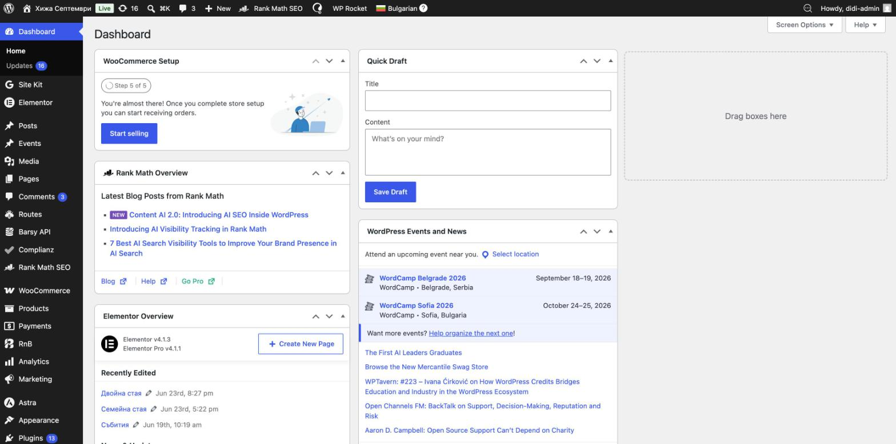
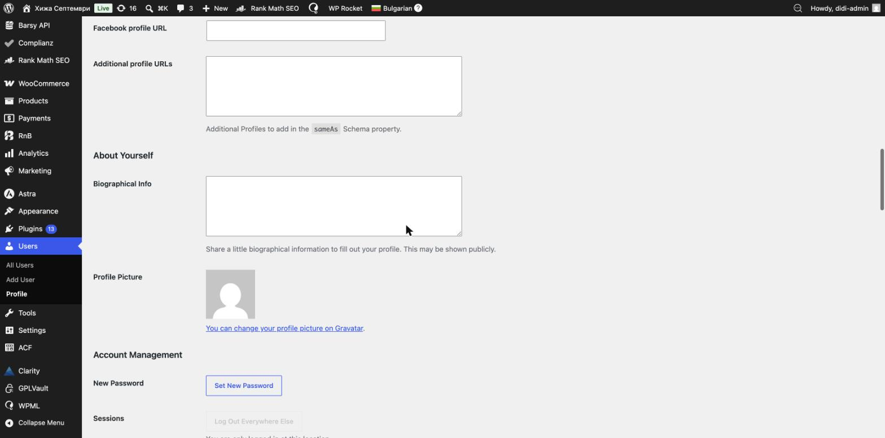

# Първи стъпки

Този раздел обяснява основите — как да влезете, как изглежда администрацията и как да запазвате промените си.

---

## Вход в сайта

1. Отворете в браузъра: **`https://septemvrihut.bg/wp-admin`**
2. Въведете **потребителско име** и **парола**.
3. Натиснете **Log In** (Вход).

След входа се отваря **началния екран (Dashboard)**.

> 🟢 **Съвет:** запазете си адреса `/wp-admin` в отметки (bookmarks), за да влизате бързо.

---

## Началният екран (Dashboard)

- **Ляво меню** — оттук се стига до всичко: Резервации (WooCommerce), Стаи (Products), Събития (Events), Страници (Pages), Маршрути (Routes), Медия и т.н.
- **Горна черна лента** — бързи връзки; вдясно е вашето име (**Howdy, …**), откъдето излизате и стигате до профила си.
- Началният екран съдържа информационни блокчета — не е нужно да ги пипате.

> 🟢 Разглеждането на менютата е безопасно — докато не натискате **Update/Publish** или бутони за изтриване, нищо не се променя.

---

## Запазване, публикуване и преглед

Когато редактирате нещо (страница, събитие, стая), отдясно има бутони:

- **Save Draft** (Запази чернова) — запазва, но **не** показва промяната на сайта.
- **Preview** (Преглед) — показва как ще изглежда, преди да е публично.
- **Publish** (Публикувай) — за нов елемент, пуска го на живо.
- **Update** (Обнови) — за вече съществуващ елемент, запазва промените на живо.

> ⚠️ **Важно:** промяна, която не сте **Update/Publish**-нали, не е запазена. Винаги натискайте бутона, преди да напуснете страницата.

---

## Изчистване на кеша (WP Rocket)

Сайтът използва кеш (WP Rocket), за да зарежда бързо. Понякога след промяна **може да не видите резултата веднага**. Тогава изчистете кеша:

- В **горната черна лента** натиснете **WP Rocket → Clear cache** (Изчисти кеша), или
- В списъците (стаи, събития) под всеки елемент има връзка **Clear this cache** (Изчисти този кеш).

След това презаредете страницата на сайта (Ctrl/Cmd + R).

> 🟢 Изчистването на кеша е безопасно.

---

## Смяна на вашата парола

1. Горе вдясно натиснете името си (**Howdy, …**) → **Edit Profile** (или меню **Users → Profile**).
2. Слезте до **Account Management → New Password**.
3. Натиснете **Set New Password**, въведете нова парола и я запазете с **Update Profile** най-долу.

> ⚠️ Използвайте **силна** парола и не я споделяйте. Ако трябва нов достъп за друг човек, пишете на екипа — **не** създавайте потребители сами (виж [Какво е безопасно](12-safety-troubleshooting.md)).

---

📌 Виж и: **[Какво е безопасно и какво да не пипаме](12-safety-troubleshooting.md)**
