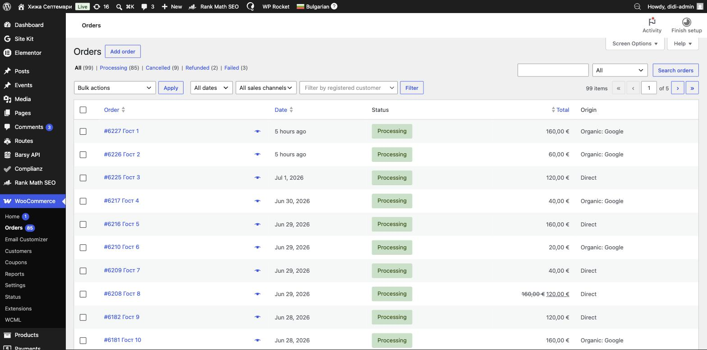
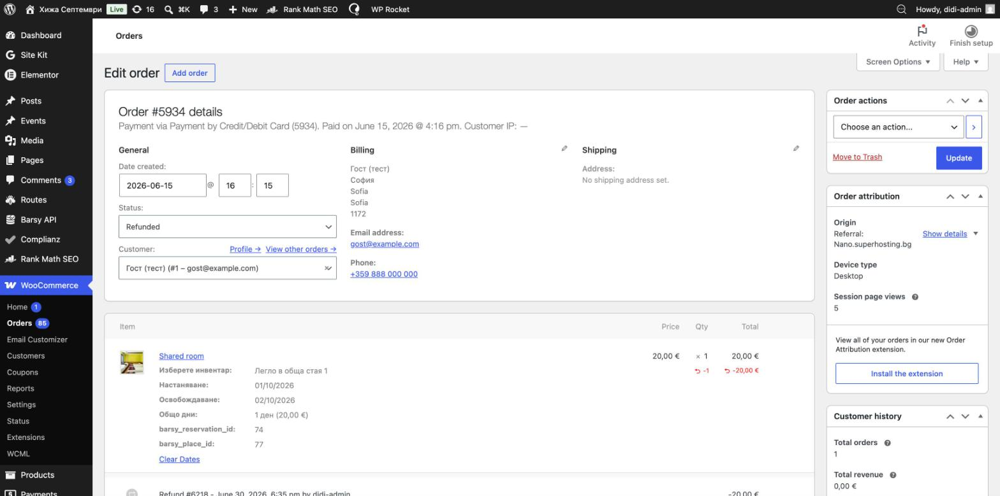
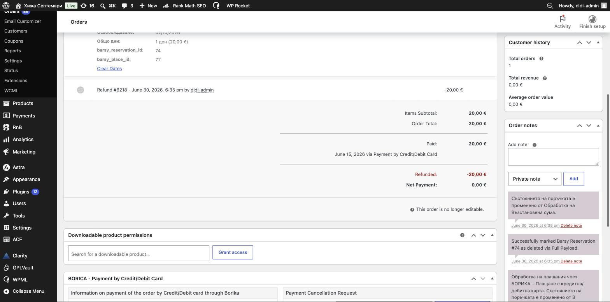
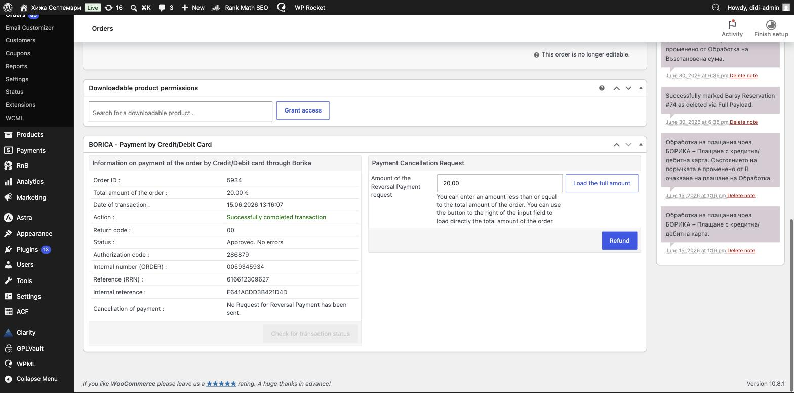

# Резервации и поръчки

Всяка резервация в сайта е **поръчка (Order)** в WooCommerce. Тук намирате резервациите, преглеждате ги, връщате пари, отказвате или променяте.

> ⚠️ **Внимание — това е най-чувствителната част.** Поръчките са свързани със системата **Barsy** и с плащанията през **Борика**. Погрешна промяна може да обърка реална резервация. Работете спокойно с преглеждането; при връщане на пари и отказ следвайте стъпките точно.

---

## Къде са резервациите

Ляво меню → **WooCommerce → Orders** (Поръчки).

Отгоре има филтри по състояние:

- **All** — всички
- **Processing** (Обработва се) — платена, активна резервация
- **Cancelled** (Отказана)
- **Refunded** (Възстановена сума)
- **Failed** (Неуспешна) — плащането не е минало

*(На снимката имената на гостите са скрити за поверителност — при вас ще виждате истинските имена.)*

### Как да намерите конкретна резервация
- Полето за търсене горе вдясно — по **номер на поръчка**, **име** или **имейл**.
- Филтрите **All dates** (по дата) и **All sales channels** (канал).

---

## Как да разчетете една резервация

Отворете поръчка (натиснете номера ѝ). Ще видите:

- **Status** (Състояние) — падащото меню горе ляво.
- **Billing** — данни на госта (име, имейл, телефон).
- **Item** (артикул) — резервираната стая и важните полета:
  - **Изберете инвентар** — коя точно стая/легло е резервирано;
  - **Настаняване** — дата на пристигане; **Освобождаване** — дата на тръгване;
  - **Общо дни** — брой нощувки и сума;
  - **barsy_reservation_id** и **barsy_place_id** — връзката към Barsy.

> ⛔ **Не пипайте** полетата `barsy_reservation_id`, `barsy_place_id` и връзката **Clear Dates**. Те свързват резервацията с Barsy — ръчна промяна ги разваля.

### Проверка дали резервацията е синхронизирана
Отдясно, в **Order notes** (Бележки), системата записва автоматично какво се е случило — напр. *„Successfully marked Barsy Reservation #74 as deleted“* или бележки за Борика. **Ако нещо се обърка, първо погледнете бележките** — там пише какво е станало.

---

## Статуси на поръчката (какво означават)

| Статус | Значение |
|--------|----------|
| **Processing** | Платена, активна резервация. Нормалното състояние. |
| **Completed** | Приключена (престоят е минал). |
| **On hold** | Изчаква плащане/потвърждение. |
| **Cancelled** | Отказана — датите се освобождават. |
| **Refunded** | Върнати са пари на госта. |
| **Failed** | Плащането не е успяло — не е валидна резервация. |

---

## Връщане на пари (Refund)

Връщането на пари става през панела на **Борика**, най-долу в поръчката.

1. Отворете поръчката и слезте до панела **BORICA – Payment by Credit/Debit Card**.
2. Вдясно, в **Payment Cancellation Request**, въведете сумата за връщане — или натиснете **Load the full amount** за пълно връщане.
3. Натиснете **Refund** (Върни).
4. Готово: сумата се връща на картата на госта през Борика, статусът става **Refunded**, а резервацията се **премахва от Barsy и от календара** автоматично.

> ⚠️ Проверете в **Order notes**, че е записано успешно връщане и *„Barsy Reservation … deleted“*. Ако липсва — пишете на екипа.
>
> ⛔ Връщането на пари е **необратимо**. Правете го само когато сте сигурни.

---

## Отказ на резервация (Cancel)

- Ако гостът **е платил** и трябва да му върнете парите → използвайте **Refund** (по-горе). Това освобождава датите и премахва резервацията от Barsy.
- Ако резервацията **не е платена** (Failed / On hold) → сменете **Status** на **Cancelled** и натиснете **Update**.

> ⚠️ След отказ проверете в **Order notes**, че резервацията е премахната от Barsy. Датите трябва да са освободени за нови резервации.

---

## Промяна на датите на резервация

Не променяйте датите директно в платена поръчка — това **не** се пренася коректно към Barsy и календара.

**Правилният начин:**
1. **Върнете парите / откажете** старата резервация (по стъпките по-горе) — така старите дати се освобождават и резервацията се маха от Barsy.
2. **Направете нова резервация** за новите дати (виж по-долу).

Така и Barsy, и календарът се обновяват правилно.

---

## Резервация за гост по телефона (ръчна резервация)

Когато гост резервира по телефон или на място, направете резервацията **както обикновен гост — през сайта отпред**, докато сте влезли като администратор:

1. Отворете сайта отпред и минете нормалния процес на резервация (изберете дати, стая, брой хора).
2. На стъпката за плащане ще видите допълнителна опция **„Плащане в брой / Cash on delivery“**, която е видима **само за администратори**.
3. Изберете нея и завършете поръчката.

> 🟢 Понеже минава през нормалния процес, резервацията **автоматично** отива в Barsy и в календара — точно както при онлайн гост.
>
> ⛔ **Не** използвайте бутона **Add order** в администрацията за нови резервации — така направена поръчка няма да се синхронизира правилно.

---

## Изпращане на имейл до госта отново

В поръчката, горе вдясно, в **Order actions** (Действия) → изберете действие от **Choose an action** (напр. препращане на детайлите/фактурата към госта) и натиснете стрелката ➜.

---

## ⛔ Какво да НЕ пипаме в поръчките

- Полетата `barsy_reservation_id`, `barsy_place_id`, **Clear Dates**.
- Датите на платена поръчка (вместо това: откажи + нова резервация).
- Не триете поръчки на реални гости.

---

📌 Виж и: **[Какво е безопасно и решаване на проблеми](12-safety-troubleshooting.md)**
