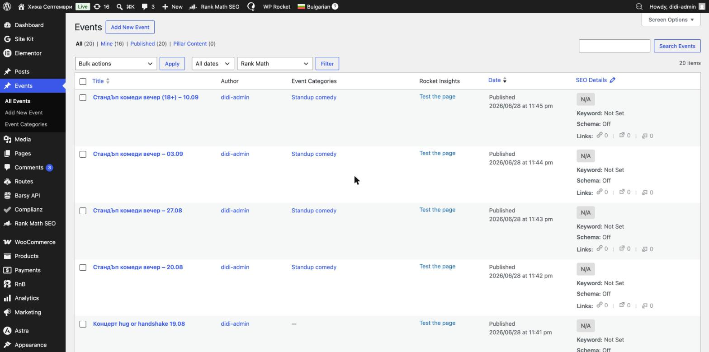
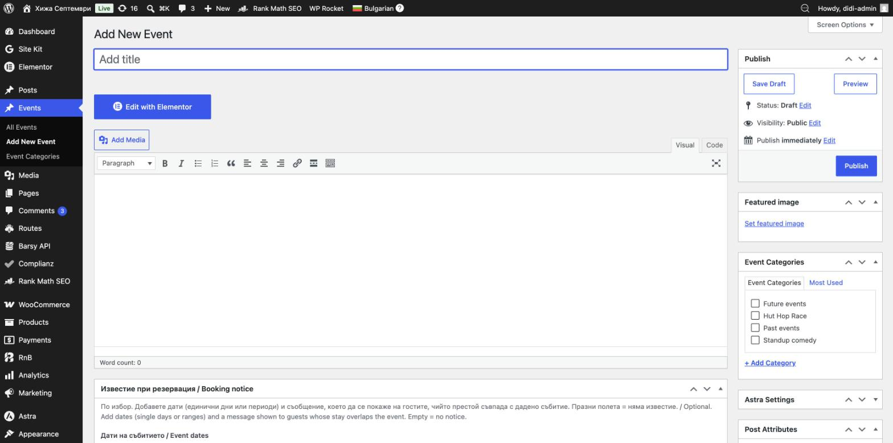
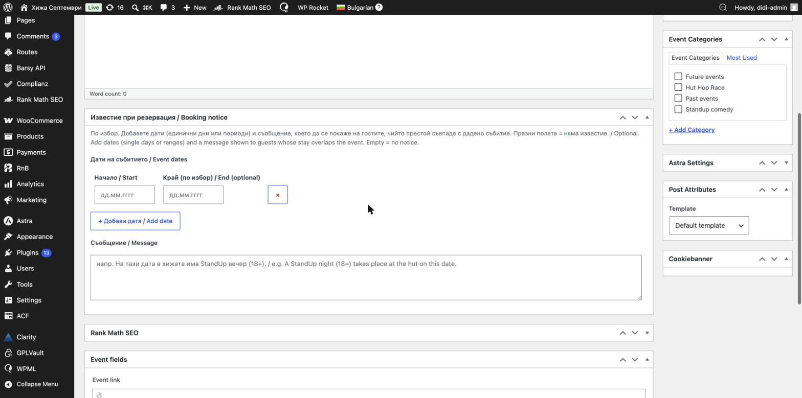

# Събития (Events)

Тук създавате и управлявате **събитията** на хижата — концерти, стендъп вечери, състезания, доброволчески инициативи и др. Всяко събитие е отделна страница, която се показва в раздела „Събития“ на сайта.

> 🟢 **Безопасно:** създаването, редактирането и изтриването на събития не влияе на резервациите или на плащанията. Тук можете да работите спокойно.

---

## Къде се намират събитията

В лявото меню на администрацията изберете **Events** (Събития). Отваря се списък с всички събития — заглавие, автор, категория и дата на публикуване.

Оттук можете да:
- отворите съществуващо събитие за редакция — задръжте мишката върху заглавието и натиснете **Edit** (Редактирай);
- изтриете събитие — **Trash** (Кошче);
- създадете ново — бутонът **Add New Event** (Добави ново събитие) горе.

---

## Как да създадете ново събитие

1. Натиснете **Add New Event** (Добави ново събитие).
2. В полето **Add title** въведете **заглавието** на събитието (напр. „Стендъп вечер – 10.09“).
3. В голямото текстово поле напишете **описанието** на събитието. Можете да форматирате текста с бутоните отгоре, а със **Add Media** да вмъкнете снимки.
4. Задайте **главна снимка**, **категория** и (по избор) **известие при резервация** — вижте разделите по-долу.
5. Когато сте готови, натиснете **Publish** (Публикувай).

---

## Полетата подробно

**Заглавие (Add title)**
Името на събитието. Показва се като заглавие на страницата и в списъка със събития.

**Съдържание / Edit with Elementor**
Описанието на събитието. За повечето събития е достатъчно да пишете направо в текстовото поле. Ако събитието има специална, по-сложна визия, тя се прави с бутона **Edit with Elementor** — за него вижте раздел „Редактиране на страници“.

**Главна снимка (Featured image)**
Основната снимка на събитието (афишът). Натиснете **Set featured image** (Задай главна снимка) и изберете или качете изображение. Тази снимка се показва на плочката на събитието в сайта.

**Категории (Event Categories)**
Отдясно, отметнете категорията на събитието:
- **Future events** — за **предстоящи** събития;
- **Past events** — за **отминали** събития;
- тематични категории като **Standup comedy** или **Hut Hop Race**.

> ⚠️ **Внимание:** категорията определя **къде** се показва събитието на сайта. Когато едно събитие мине, преместете го от **Future events** в **Past events**, за да не стои в „предстоящи“.

**Известие при резервация / Booking notice**
Това е специално поле само за този сайт. Ако въведете дати и съобщение тук, всеки гост, чийто престой **съвпада** с тези дати, ще види съобщението, докато прави резервация (напр. „На тази дата в хижата има стендъп вечер (18+)“).

- **Дати на събитието (Начало / Край)** — въведете дата във формат **ДД.ММ.ГГГГ**. Полето „Край“ е по избор — попълнете го само ако събитието трае няколко дни. С **+ Добави дата** можете да добавите още дати.
- **Съобщение** — текстът, който гостът вижда.
- Ако оставите полетата **празни**, няма да се показва никакво известие. Това поле е изцяло по избор.

**Event link (Линк към събитието)**
По избор. Линк към външна страница за билети или повече информация (напр. към Facebook събитие или сайт за билети).

---

## Публикуване

Отдясно, в блока **Publish**:
- **Save Draft** (Запази чернова) — запазва, без да публикува. Събитието **не** се вижда на сайта.
- **Preview** (Преглед) — показва как ще изглежда, преди да публикувате.
- **Publish** (Публикувай) — публикува събитието на живо на сайта.

За вече публикувано събитие бутонът се казва **Update** (Обнови) — натискайте го след всяка промяна, за да се запази.

> ⚠️ **Внимание:** ако след публикуване не виждате промяната на сайта веднага, изчистете кеша — вижте „Първи стъпки“ → „Изчистване на кеша (WP Rocket)“.

---

## На английски (EN)

Събитията също могат да имат английска версия. Как се превежда съдържание на английски е описано в раздел **„Обновяване на текстове на английски (WPML)“**.

---

📌 Виж и: **[Какво е безопасно и какво да не пипаме](12-safety-troubleshooting.md)**
