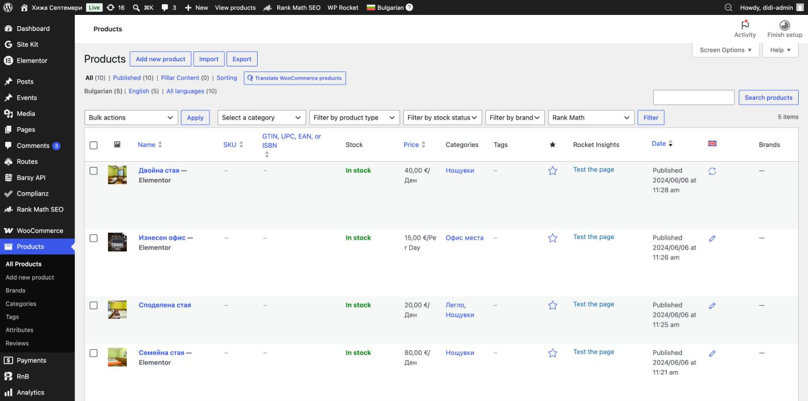
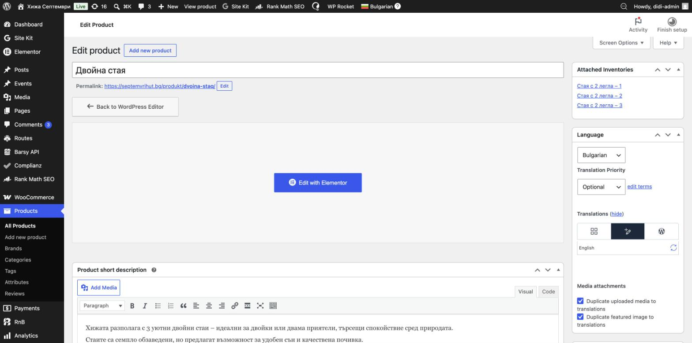
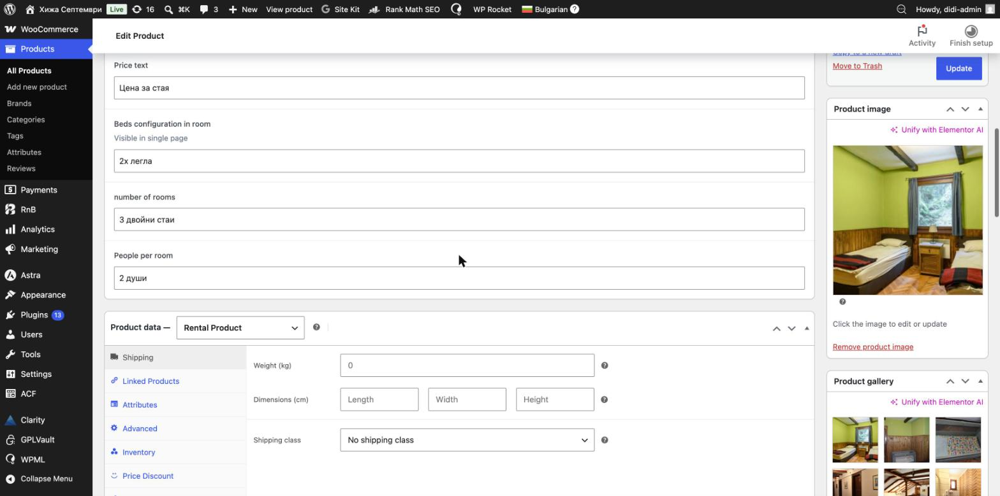
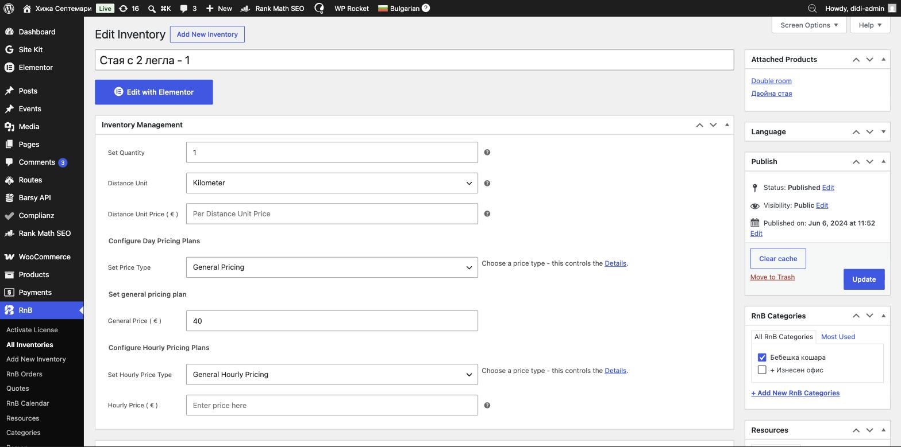

# Стаи (продукти)

Стаите за настаняване са **продукти (Products)** в WooCommerce. Тук сменяте **текстовете**, **снимките** и **цената** на всяка стая.

> ⚠️ **Внимание:** стаите са свързани с резервационната система (RnB) и с Barsy. Спокойно променяйте **текст, снимки и цена**. **Не** променяйте настройките за резервация, наличности и свързаните инвентари.

---

## Къде са стаите

Ляво меню → **Products** (Продукти).

Виждате всички стаи с цена, категория и език (**Bulgarian / English** — за преводите виж [раздел 10](10-wpml-english.md)). Натиснете името на стая, за да я редактирате.

---

## Смяна на текстовете

В редакцията на стаята:

- **Product short description** (Кратко описание) — основният текст на стаята. Пишете директно; форматирате с бутоните; със **Add Media** добавяте снимка.
- **Product fields** (по-долу) — допълнителни полета, които се показват на страницата: брой легла, брой стаи, хора в стая и т.н. Може да ги редактирате свободно.

> ⛔ **Не пипайте** блока **Attached Inventories** (Свързани инвентари) горе вдясно — той свързва стаята с резервационната система.

---

## Смяна на снимките

Отдясно, надолу:

- **Product image** (Главна снимка) — основната снимка. Натиснете снимката или **Remove product image**, за да я смените.
- **Product gallery** (Галерия) — допълнителните снимки. **Add product gallery images** добавя нови; задръжте и плъзнете, за да пренаредите; ×, за да махнете.

Препоръки за размер на снимките — виж [раздел 9](09-media-images.md).

---

## Смяна на цената

Цената **не** се въвежда в самата стая, а в нейния **инвентар** (RnB).

1. В редакцията на стаята отворете **Product data → Inventory** — там са изброени инвентарите на стаята (напр. „Стая с 2 легла – 1, – 2, – 3“).
2. Отворете инвентара (или през ляво меню **RnB → All Inventories**).
3. В блока **Inventory Management** намерете **General Price ( € )** и въведете новата цена (на снимката — **40**).
4. Натиснете **Update** (Обнови).

> ⚠️ **Много важно:** някои стаи имат **няколко инвентара** (напр. двойните стаи имат 3, а общата стая — по едно легло на инвентар). Ако сменяте цената на такава стая, сменете **General Price на всеки инвентар**, за да е еднаква навсякъде.
>
> ⛔ В инвентара променяйте **само** полето **General Price**. **Не** пипайте „Set Quantity“, „Attached Products“, категориите и другите настройки — те държат резервациите и връзката с Barsy.

---

## Запазване и кеш

- Натиснете **Update** (Обнови) след всяка промяна.
- Ако не виждате промяната на сайта, натиснете **Clear cache** (в блока Publish) — виж [раздел 1](01-getting-started.md).

---

## На английски (EN)

Всяка стая има английска версия (текст и цена се управляват отделно). Виж [раздел 10 — WPML](10-wpml-english.md).

---

📌 Виж и: **[Какво е безопасно и решаване на проблеми](12-safety-troubleshooting.md)**
