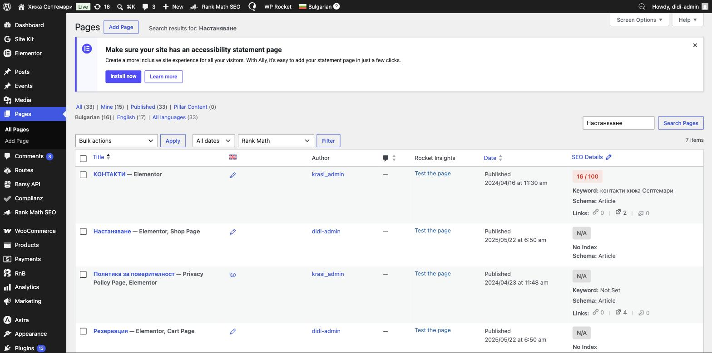

# Страница „Настаняване“

Страницата **„Настаняване“** е списъкът с всички стаи на сайта (адрес: `septemvrihut.bg/nastanqvane/`). Технически това е **магазинната страница (Shop Page)** на WooCommerce и е изградена с **Elementor**.

> 🟢 **Важно за разбиране:** плочките със стаи на тази страница идват автоматично от **самите стаи (продукти)**. За да смените текст, цена или снимка на стая — редактирайте **стаята**, а не тази страница. Виж [раздел 4 — Стаи](04-products.md).

---

## Къде се намира

Ляво меню → **Pages** (Страници) → **Настаняване** (обозначена е като **„Shop Page“**).

Задръжте върху заглавието и изберете:
- **View** — да видите страницата на сайта;
- **Edit with Elementor** — да редактирате оформлението (заглавие, увод, подредба).

---

## Какво може да се редактира тук

С **Elementor** на тази страница се променят само „рамката“ и текстовете около списъка:
- **уводният текст** отгоре (напр. „Открийте комфортно настаняване…“);
- **заглавната снимка** и секциите около списъка със стаи.

Как се работи с Elementor — виж [раздел 8 — Редактиране на страници](08-other-pages.md).

> ⛔ **Не пипайте** самия блок със списъка на стаите и настройките на магазина. Плочките се пълнят автоматично от продуктите.
>
> ⚠️ След редакция натиснете **Update** в Elementor и при нужда изчистете кеша (виж [раздел 1](01-getting-started.md)).

---

## Често: „Искам да променя стая от тази страница“

Не се прави оттук. За стая:
- **текст / снимки / цена** → [раздел 4 — Стаи (продукти)](04-products.md);
- **свободни дати / затваряне** → [раздел 6 — Свободни дати](06-availability.md).

---

📌 Виж и: **[Какво е безопасно и решаване на проблеми](12-safety-troubleshooting.md)**
